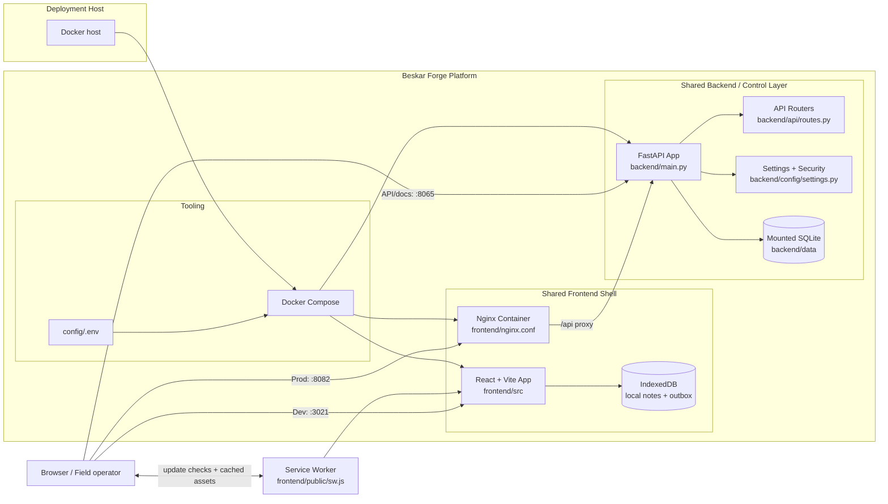

# Architecture

Beskar Forge is a PWA-first starter for focused applications, including field
tools that must keep working when connectivity is unreliable.

The current target shape is:

- a React + Vite installable frontend
- a FastAPI backend for calculations, API integration, and simple local data
- an IndexedDB local store and outbox for offline feature data
- a small SQLite-backed synchronization boundary for the reference workflow
- an Nginx production edge for static assets and API proxying
- a service worker for deploy-and-reload behavior
- a Docker-capable deployment/control host

The full Garden Planner reference application is maintained separately at
https://github.com/martin-gomola/garden-planner. This repository keeps only the
smallest useful offline-first reference workflow so copies have a working
baseline without carrying a large app-specific domain.

Typical applications built from the template include:

- a portfolio app
- an internal dashboard
- calculators and planning tools
- small data-backed utilities
- focused homelab controls

## System Diagram

## Platform Model

The platform is designed around a split between:

- shared platform concerns
- app-specific business logic

Shared platform concerns live here:

- frontend shell and shared navigation
- backend control APIs
- local-first feature storage and synchronization contracts
- auth and request protection patterns
- deployment workflow
- health checks
- environment loading
- service worker and rollout behavior

App-specific concerns should be migrated in gradually and kept modular so they can evolve without turning the platform into a monolith.

## Runtime Modes

### Development

- `docker-compose.yml` + `docker-compose.dev.yml` run the backend with live reload and the frontend with the Vite dev server.
- The frontend is exposed on `http://localhost:3021`.
- The backend is exposed on `http://localhost:8065`.
- Source directories are bind-mounted so frontend and backend changes reload without rebuilding the image.

### Production-like Local Run

- `docker-compose.yml` builds the frontend into static assets and serves them from Nginx on host port `8082`.
- Nginx proxies `/api/*` requests to the backend container on port `8060`.
- The backend keeps a mounted `backend/data` directory for runtime data.
- This is the same operational shape intended for deployment to a self-hosted Docker machine or VPS.

## Component Responsibilities

### Frontend

- `frontend/src/App.tsx` renders the platform shell and the update banner.
- `frontend/src/components/PullToRefresh.tsx` exposes a touch pull gesture that checks for waiting service-worker updates.
- `frontend/src/features/field-notes/FieldNotesScreen.tsx` renders local-first capture, sync status, and conflict recovery.
- `frontend/src/features/field-notes/useFieldNotesSession.ts` owns Field Notes state transitions, browser lifecycle, and actions.
- `frontend/src/features/field-notes/fieldNotesStore.ts` supplies the browser storage and sync adapter, including IndexedDB records, the mutation outbox, the sync cursor, and device identity.
- `frontend/src/platform/` owns app-wide local-data clearing and explicit notification helpers that new features can reuse.
- `frontend/src/platform/updateLifecycle.ts` owns production worker registration, scheduled checks, waiting-worker detection, accepted updates, and guarded reloads.
- `frontend/src/main.tsx` bootstraps React and starts the update lifecycle in production.
- `frontend/src/hooks/useServiceWorkerUpdate.ts` adapts lifecycle state for React.
- `frontend/public/sw.js` manages the app-shell cache and user-controlled update activation.
- `frontend/nginx.conf` serves the built app, caches hashed assets, and proxies API traffic in production.

### Backend

- `backend/main.py` is the thin entrypoint for local runtime and Uvicorn startup.
- `backend/app_factory.py` creates the FastAPI app, installs middleware, and wires routes.
- `backend/api/routes.py` exposes the root, health, and version endpoints used by the starter and by deployment checks.
- `backend/config/settings.py` centralizes environment-driven configuration and request-safety helpers.
- `backend/api/field_notes.py` applies idempotent note mutations, returns cursor-based changes, and exposes optimistic conflicts.
- Security middleware in `backend/security.py` combines:
  - CORS validation
  - trusted-host checks
  - API key enforcement for non-browser external requests
  - rate limiting via `slowapi`

### Tooling

- `docker-compose.yml` defines the production-shaped local stack.
- `docker-compose.dev.yml` overrides that stack for faster local iteration.
- `Makefile` provides the common entry points like `make dev`, `make prod`, and `make deploy`.

## Feature Growth Strategy

Grow one user-visible capability at a time without introducing infrastructure before it is needed.

Recommended sequence:

1. Identify the smallest useful user flow.
2. Decide whether it needs:
   - frontend-only behavior
   - a backend calculation or external API call
   - local-first persistence and synchronization
3. Reuse existing platform conventions for health checks, env handling, versioning, and deployment.
4. Add routing, a server database, or background work only when a real feature requires it.
5. Keep each added dependency justified by observable behavior and covered by validation.

## Request Flow

### Production HTTP flow

1. The browser requests the app from Nginx on host port `8082`.
2. Nginx serves `index.html` and static assets from `frontend/dist`.
3. API requests under `/api/` are proxied from Nginx to the FastAPI backend.
4. FastAPI applies security middleware and route handling before responding.
5. Application routes can call focused calculation or storage modules behind the shared backend surface.

## Offline field workflow

The reference field-notes flow has two data owners:

- IndexedDB owns the immediate user experience. Notes are written locally before any network request.
- SQLite owns the self-hosted server copy. The sync API applies mutations by client idempotency key and optimistic version.

The page drains its outbox on startup, foregrounding, reconnect, and explicit
user request. The service worker caches only application assets; it does not
own domain data or silently cache API responses.

An update is considered safe only when local data survives an app restart and
service-worker activation. Server conflicts remain visible until the operator
chooses the local or server copy. Render's free backend remains demo-only for
this workflow because its filesystem is ephemeral; use a persistent deployment
for production field data.

`/api` is a cross-layer invariant shared by the frontend client, Nginx,
FastAPI, the service worker, tests, and documentation. It is not an environment
setting. Compose derives deployment names from the checkout directory so two
renamed copies can coexist.

### Deploy-and-reload flow

1. A new frontend build updates the service worker build version.
2. The browser checks for an updated service worker hourly or when an overdue tab becomes visible.
3. The new worker installs and waits while the previous worker and cache stay active.
4. The update lifecycle exposes a waiting worker to `useServiceWorkerUpdate()`.
5. User acceptance sends `SKIP_WAITING` to the waiting worker.
6. The worker activates, cleans only old app caches, and claims clients.
7. Each open tab observes the controller change and reloads once.

On touch interfaces, pulling down from the top of the page invokes the same
update check and leaves activation under the existing user-controlled **Update
now** action.

## Source of Truth

When this document and the code disagree, the code wins. The best places to confirm behavior are:

- `docker-compose.yml`
- `docker-compose.dev.yml`
- `frontend/nginx.conf`
- `backend/app_factory.py`
- `backend/security.py`
